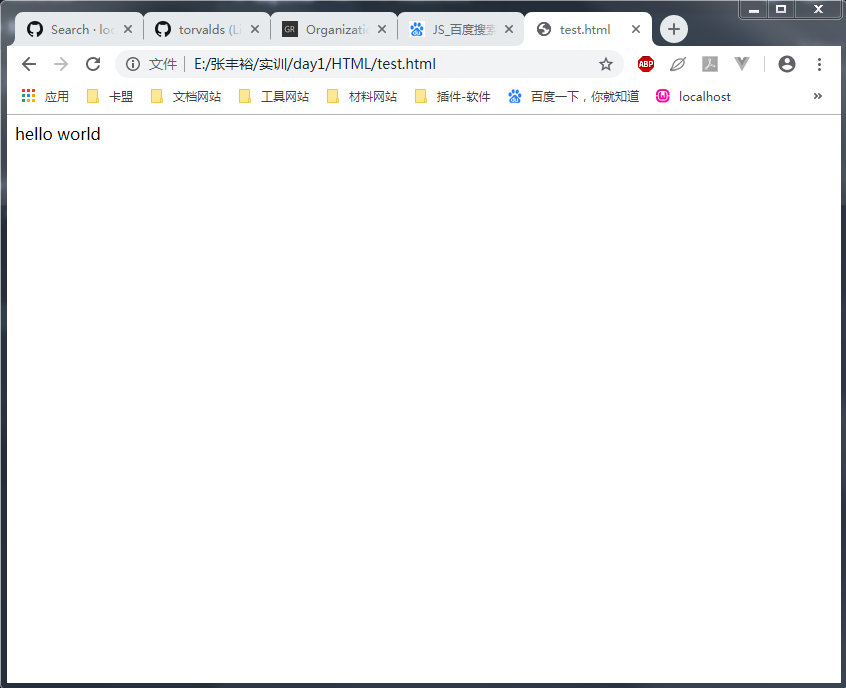

# 前端

现阶段大部分我们用户看到的东西，都有JS的身影

手机的APP，浏览器(用户在移动设备看到的)

> JS , HTML , CSS

### JS

JavaScript 是属于 HTML 和 Web 的编程语言，英文单词实现的
```js
// 把1赋值给num这个变量
var num = 1;
var text = '百度两下'; // 字符串
// 选择器
document.querySelector(需要选择的标签的名字);
// 选中文档的第一张图片
// 选中
document.querySelector("img");
// 选中文档的所有图片
document.querySelectorAll(需要选择的标签的名字);

// 选择ID
document.querySelectorAll("#id");
// 那就是选择<xxx id="go">
document.querySelectorAll("#go");
// 那就是选择<xxx class="go">
document.querySelectorAll(".go");
```

### HTML

新建一份文件`index.html`，注意使用`.html后缀`

这份文件你可以直接拖入浏览器里面打开

```html
hello world
```
你会在页面看到一段`hello world`

```
<xxx xxx="xxx" />
<xxx>内容</xxx>
```

|标签|定义||
|-|-|-|
|img|图片的意思||
|p|文本的标签|<p>内容</p>|
|input|输入标签|<input />|
|span|文本标签|<p>0<span>123</span>456</p>|



### CSS

页面的装饰，html是你的脸的话，css其实就是做一个化妆
```css
<style>
    /* 定义一些风格和样式 */
    /* 文本个图片是很单调的，那如果配合css的话，将会赋予新的皮肤 */
    /* 将所有的p标签变成绿色 */
    p {
        color: green;
        /* 字体大小 */
        font-size: 50px;
    }
</style>
```

# 后端

云计算 -> 服务器

# 获取页面的信息内容

获取页面的聊天信息，单条获取的
```js
document.querySelector('pre')
document.querySelectorAll(".js_message_plain")[0]
```


# 监听

定时器
每间隔1000毫秒(1秒)触发一次逻辑
```js
setInterval(function(){
    // 打印
    console.log(1)
}, 1000)
```

# 记录第一条信息的撤回

```js
setInterval(function(){
    // 打印
    var message = document.querySelectorAll(".js_message_plain")[0].innerText;
	console.log(message);
}, 1000)
```


# 记录第一条信息的撤回

```js
// 一开始的信息的长度
var num = 0;
setInterval(function(){
    var length = document.querySelectorAll(".js_message_plain").length
    // 如果最新length等于上一个num的话，信息没更新
    if(length!=num){
        // 打印最新的一条，最后一条
        var message = document.querySelectorAll(".js_message_plain")[length-1].innerText;
        console.log(message);
        // 获取最新信息条数
        num = document.querySelectorAll(".js_message_plain").length
    }
}, 1000)
```


# 弹幕

```js
setInterval(function(){
    document.querySelector('.ChatSend-txt').value = "老姚66666"
    document.querySelector('.ChatSend-button').click()
},1000)
```