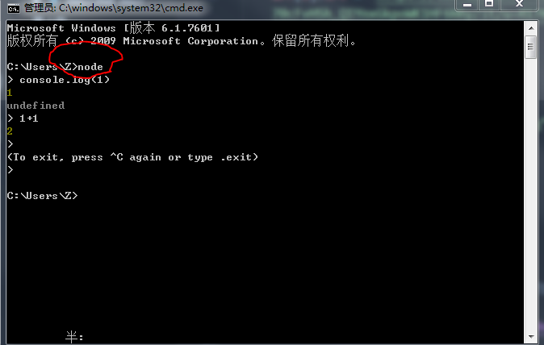
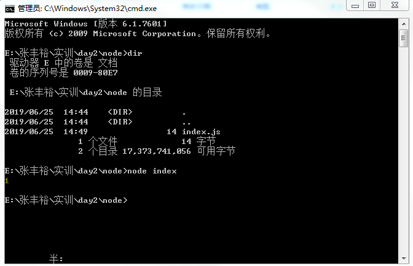

# JS

循环
```js
var arr = [0,1,2];
arr[0] //获取第一个值
```

```js
var i = 0;
for(;i<50;i++){
    console.log(i);
}
```
获取页面所有图片的地址
```js
var arr = document.querySelectorAll("img")
var i = 0
for(;i<arr.length;i++){
	console.log(arr[i].src)
}
```
整个网页所有图片信息都变成熊猫
```js
var arr = document.querySelectorAll("img")
var i = 0
for(;i<arr.length;i++){
	arr[i].src = 'https://ss0.bdstatic.com/70cFvHSh_Q1YnxGkpoWK1HF6hhy/it/u=4170442874,2519151314&fm=27&gp=0.jpg'
}
```
无图模式
```js
var arr = document.querySelectorAll("img")
var i = 0
for(;i<arr.length;i++){
	arr[i].src = ''
}
```

# Node JS

它是一个浏览器环境，但是它可以构建后端，用的JS语言

[Node JS官网 下载地址](http://nodejs.cn/download/)

点击安装包安装`node-v10.16.0-x64.msi`

默认点击安装，选项选默认

等安装包完成之后，打开电脑的命令行工具

```js
node
# version 版本号
node -v
```

金融数学

新建一个文件夹`node`
- node
	- index.js

# 运行脚本

定位到该文件夹的文件下，启动cmd
```js
node 文件名
node index.js
```

用node命令执行`index.js`代码

```js
console.log(1)
```

# 写入文件

利用node的fs文件系统去实现字符串写入
```js
// const  constant 常量
// require 获取
// 获取node提供给你的fs功能，把这个功能赋值给fs变量
var fs = require('fs');
// 打印
// console.log(fs)
// 调用fs的api接口函数去写入文件
fs.writeFileSync('./input.txt', 'hello world')
// 把hello world写入到input.txt文件下
```

# npm

[npm包管理中心](https://www.npmjs.com/)

你可以在上面搜索到很多关于node的第三方模块，运用模块来去实现一些功能
npm相当于应用商店，模块相当于应用，从npm下载好到本地，我们就可以在本地使用对应的模块功能
```
npm install 模块名
```

# wifi模块

https://www.npmjs.com/package/node-wifi

# request

```
npm install request
```