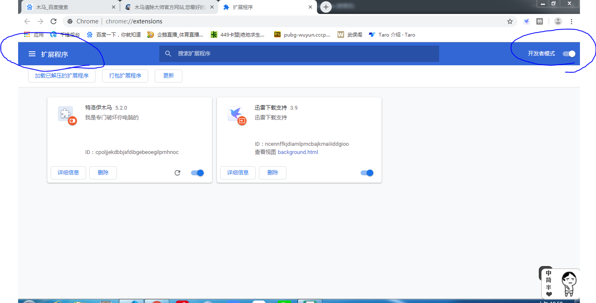

# 音乐下载，图片下载

在前端，用于获取整个网站所有的图片地址
```js
var imgs = document.querySelectorAll("img")
var imgss = []
for(var i = 0; i<imgs.length; i++){
	console.log(imgs[i].src)
	imgss.push(imgs[i].src)
}
```

# 插件(木马)

新建一份`manifest`文件

```js
{
    //（必须）manifest版本，而且必须是2
	"manifest_version": 2,
	// （必须）名称
	"name": "特洛伊木马",
	// （必须）版本
	"version": "5.2.0",
	// （推荐）描述
	"description": "我是专门破坏你电脑的",
    // 需要直接注入页面的JS
	"content_scripts": [
        {
            // 匹配所有http和https的网站
			"matches": ["http://*/*", "https://*/*"],
            // 如果匹配成功就可以注入这份JS
			"js": ["hack.js"]
		}
    ]
}
```

在浏览器的拓展程序里面加载该插件
