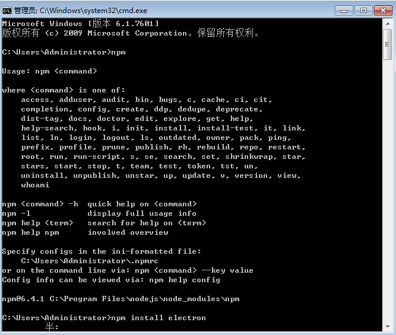

# electron

使用 JavaScript, HTML 和 CSS 构建跨平台的桌面应用

# 安装

- [node](http://nodejs.cn/download/)
- npm node平台提供给你的一个应用商店，里面有非常多第三方模块



```js
npm install electron
```

从github下载它的源代码
```js
https://github.com/electron/electron-quick-start
```

安装一些第三方依赖
```js
npm install
```

- 龙贝格求积公式
- spss
- cad3d
- visual c++